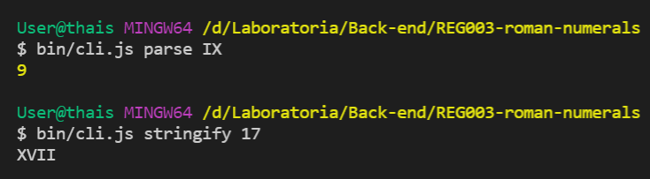
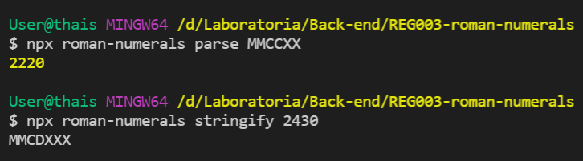
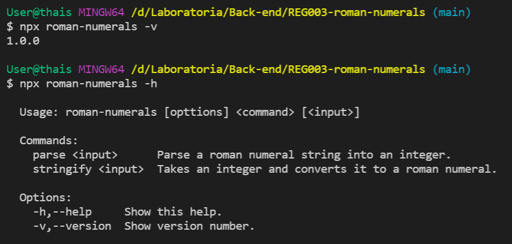
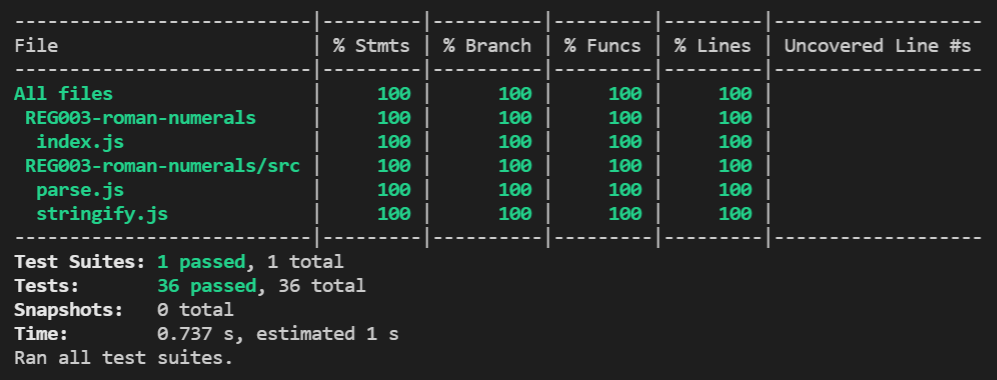

# Números romanos

## Índice

* [1. Preámbulo](#1-preámbulo)
* [2. Resumen del proyecto](#2-resumen-del-proyecto)
* [3. Instalación y uso de la librería](#3-instalación-y-uso-de-la-librería)
* [4. Pruebas unitarias](#4-pruebas-unitarias)

***

## 1. Preámbulo


> La numeración romana es un sistema de numeración que se desarrolló en la
> Antigua Roma y se utilizó en todo el Imperio romano, manteniéndose con
> posterioridad a su desaparición y todavía utilizado en algunos ámbitos.
>
> Este sistema emplea algunas letras mayúsculas como símbolos para representar
> ciertos valores. Los números se escriben como combinaciones de letras. Por
> ejemplo, el año 2020 se escribe como MMXX, donde cada M representa 1000
> unidades y cada X representa 10 unidades más.
>
> Está basado en la numeración etrusca, la cual, a diferencia de la numeración
> decimal que está basada en un sistema posicional, se basa en un sistema
> aditivo (cada signo representa un valor que se va sumando al anterior). La
> numeración romana posteriormente evolucionó a un sistema sustractivo, en el
> cual algunos signos en lugar de sumar, restan. Por ejemplo el 4 en la
> numeración etrusca se representaba como IIII (1+1+1+1), mientras que en la
> numeración romana moderna se representa como IV (1 restado a 5).
>
> Fuente: [Numeración romana - Wikipedia](https://es.wikipedia.org/wiki/Numeraci%C3%B3n_romana)

## 2. Resumen del proyecto

En este proyecto consta de un **módulo de JavaScript** (instalable via `npm`)
que permite al usuario converir [números arábigos](https://es.wikipedia.org/wiki/N%C3%BAmeros_ar%C3%A1bigos)
en [números romanos](https://es.wikipedia.org/wiki/Numeraci%C3%B3n_romana) y
viceversa. El paquete (lo que instalamos a través de `npm`) también  incluye
un script _ejecutable_ que nos permite usar la librería desde el terminal (CLI).


## 3. Instalación y uso de la librería


La **librería** y el **script ejecutable** (herramienta de línea de comando -
  CLI) están implementados en JavaScript y pueden ser ejecutados con
  Node.js.

### Módulo instalable

* Con GitHub

```sh
npm install thainole/roman-numerals
```

* Como módulo de npm

```sh
npm install roman-numerals-tn
```

### API de JavaScript

El módulo exporta un _objeto_ con dos métodos:

* `parse(str)`: Recibe un `String` como único argumento y retorna un número
  (`Number`) en caso que sea un número romano válido, en caso contrario arrojará
  un error especificando la causa.
* `stringify(num)`: Recibe un número (`Number`) y retorna un `String` con la
  representación del número recibido como número romano. En caso de que el
  número esté fuera de rango (`1 <= num <= 3999`).

Ejemplo de uso:

```js
const { parse, stringify } = require('usuario-de-github/roman-numerals');

console.log(parse('I') === 1); // true
console.log(parse('III') === 3); // true
console.log(parse('IX') === 9); // true
console.log(parse('MCMXLIV') === 1944); // true

console.log(stringify(1) === 'I'); // true
console.log(stringify(3) === 'III'); // true
console.log(stringify(9) === 'IX'); // true
console.log(stringify(1944) === 'MCMXLIV'); // true

```

### Interfaz de línea de comando (CLI - Command Line Interface)

Esta interfaz ofrece dos _sub-comandos_ (`parse` y `stringify`) además
de opciones para mostrar ayuda (`-h` y `--help`) y la versión del módulo (`-v`
y `--version`).

Ambos `parse` y `stringify` permiten un input como argumento de línea de
comando (`argv`), que en este caso es el número a
convertir.


* Ejecutando directamente a través de la ruta relativa al script `bin/cli.js`:



* Usando `npx`:



* Mostrando versión (`-v` o `--version`) y ayuda (`-h` o `--help`):




## 4. Pruebas unitarias

Las **pruebas unitarias** cubren el 100% de _statements_,
  _functions_, _lines_ y _branches_. Se utilizó el framework [Jest](https://jestjs.io/)
  para testear las pruebas unitarias.


